# Configuración del Entorno de Desarrollo.

## Configuración.

Lo primero que haremos es preparar nuestro entorno, tanto de desarrollo como de producción y agregar reglas de linter para tener buenas prácticas de desarrollo.

Es necesario tener instalado previamente Nodejs, lo puedes hacer a la fecha de creación de este tutorial en el siguiente [link](https://nodejs.org/en)

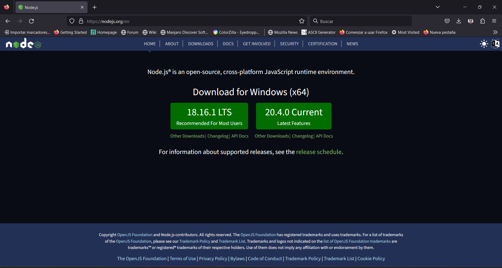

Se sugiere instalar la versión LTS disponible al momento de descargar, en este caso está disponible la versión **18.16.1 LTS**

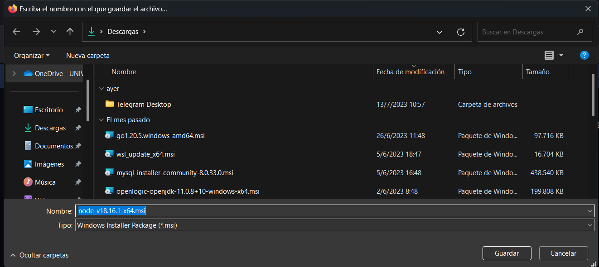

La instalación es bastante sencilla en Windows, basta con leer las indicaciones y dar clic según corresponda en Next

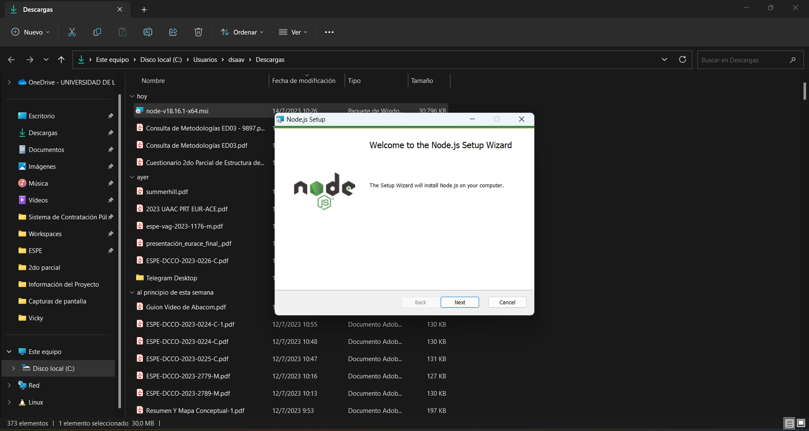

Una vez instalado Nodejs en nuestro ordenador, procedemos a verificar que el mismo se encuentra instalado, lo pueden hacer con el código

```bash
node --version
```

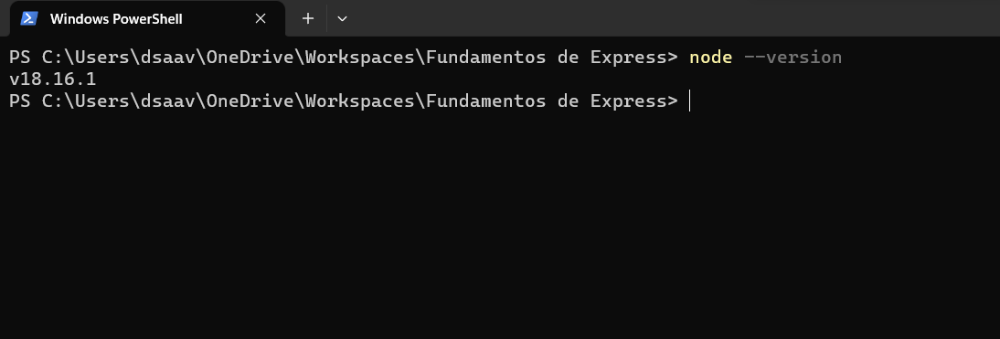

Nos ubicamos en el directorio donde vamos a crear nuestro proyecto nos ubicamos a traves del editor de código, se sugiere VSCode, pero puedes utilizar el que desees.

Ingresamos el siguiente código para iniciar un proyecto en nodejs

```bash
npm init -y
```
Esto permitirá tener una configuración por defecto en un proyecto creando el archivo package.json

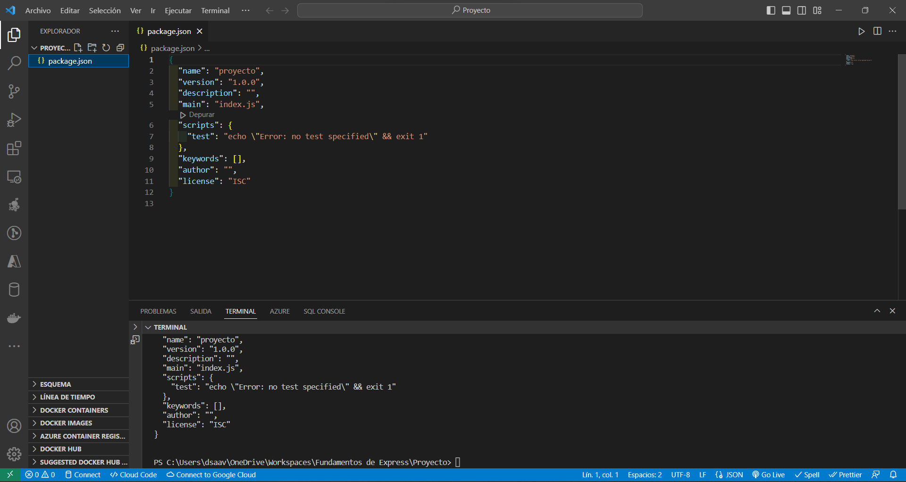

En el mismo se destaca una versión, una licencia y el formato que debe tener nuestro archivo de configuración inicial.

Como buena práctica de uso de código en un proyecto nuevo, se sugiere inicializar un gestor de versiones como git.

```bash
git init
```
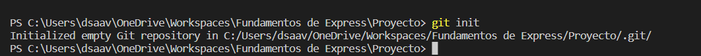

Si todo ha salido bien hasta este punto, es necesario empezar a crear los distintos archivos que formaran parte de las configuraciones.

Agregamos el archivo .gitignore, .editorconfig, .eslintrc.json

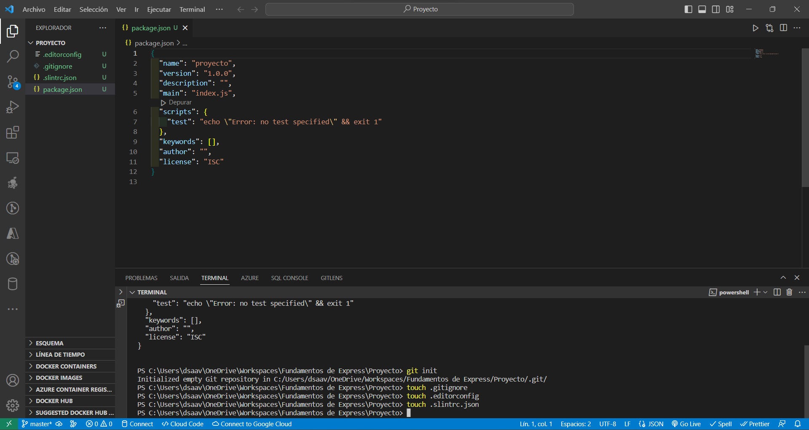

También es importante en este punto crear el archivo inicial **index.js**

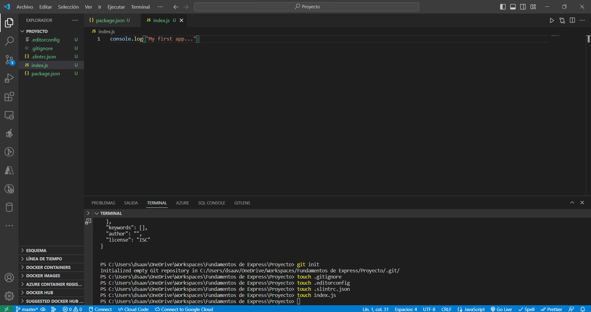

Se recomienda utilizar el sitio [gitignore.io](https://www.toptal.com/developers/gitignore/) para generar automáticamente el archivo .gitignore, tomando en cuenta la tecnología base como node y los sistemas operativos habituales (Mac OS, Linux, Windows)

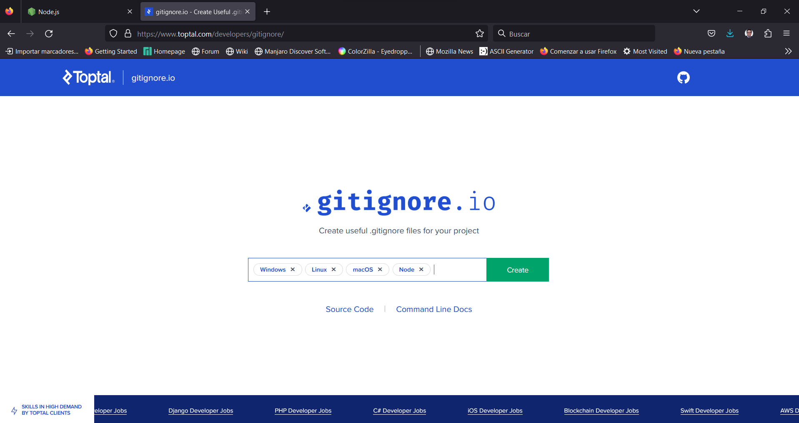

Finalmente podemos copiarlo o descargarlo y remplazar el archivo vació de nuestro proyecto.

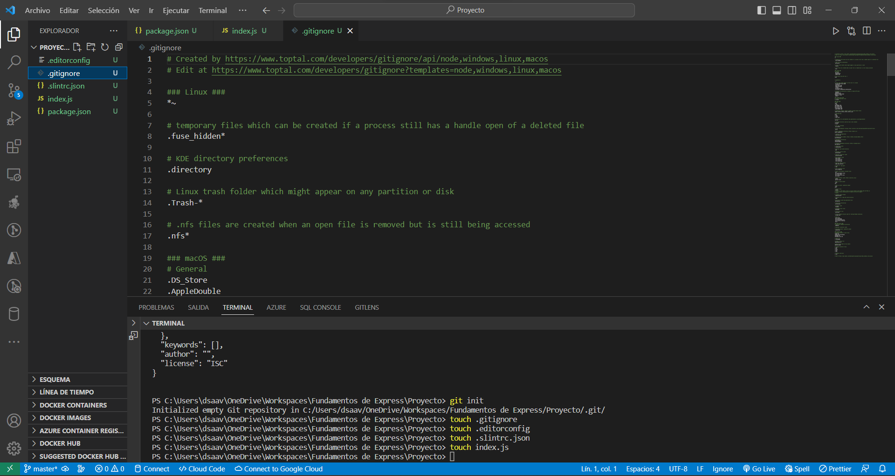

Para poder trabajar con el archivo **.editorconfig** se sugiere instalar el siguiente plugin en VSCode.

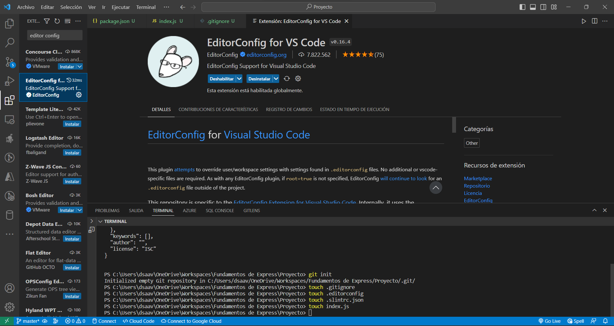

Para facilitarnos las cosas por favor agregar esta configuración en el archivo antes mencionado.

```config
# Editor configuration, see https://editorconfig.org
root = true

[*]
charset = utf-8
indent_style = space
indent_size = 2
insert_final_newline = true
trim_trailing_whitespace = true

[*.js]
quote_type = single

[*.md]
max_line_length = off
trim_trailing_whitespace = false

```
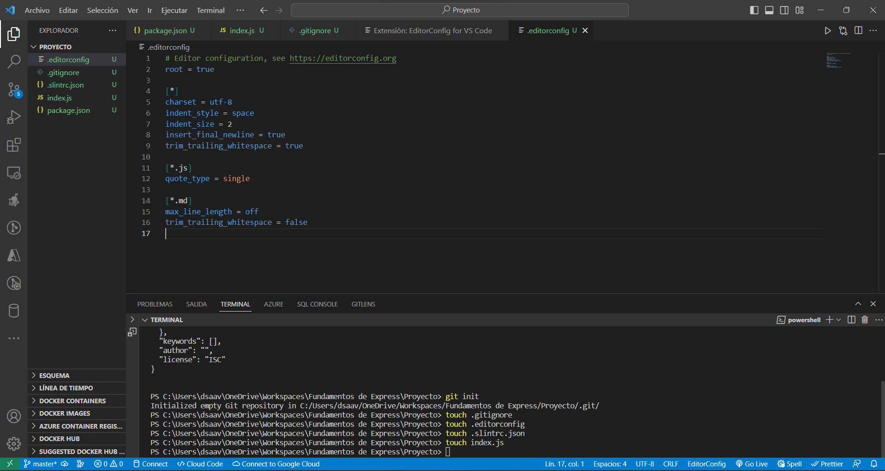

De la misma forma hacemos con el archivo .eslintrc.json

```json
{
  "parserOptions": {
    "ecmaVersion": 2018
  },
  "extends": [
    "eslint:recommended",
    "prettier"
  ],
  "env": {
    "es6": true,
    "node": true,
    "jest": true
  },
  "rules": {
    "no-console": "warn"
  }
}
```
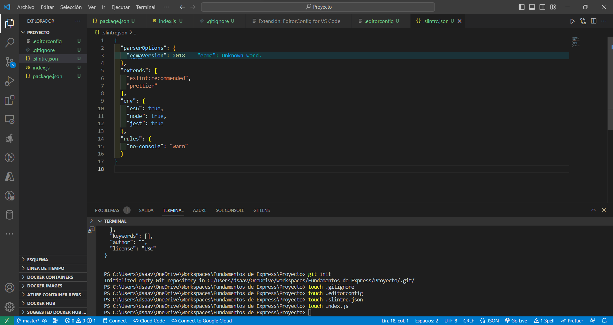

Ahora nos concentramos en el archivo **package.json** para ello agregamos la siguiente configuración.

```json
{
  "name": "my-store",
  "version": "1.0.0",
  "description": "",
  "main": "index.js",
  "scripts": {
    "dev": "nodemon index.js",
    "start": "node index.js",
    "lint": "eslint"
  },
  "keywords": [],
  "author": "",
  "license": "ISC",
  "devDependencies": {
    "eslint": "^7.32.0",
    "eslint-config-prettier": "^8.3.0",
    "eslint-plugin-prettier": "^3.4.1",
    "nodemon": "^2.0.12",
    "prettier": "^2.3.2"
  }
}
```
En este punto es necesario instalar algunas dependencias necesarias.

```bash
npm i nodemon eslint eslint-config-prettier eslint-plugin-prettier prettier -D
```

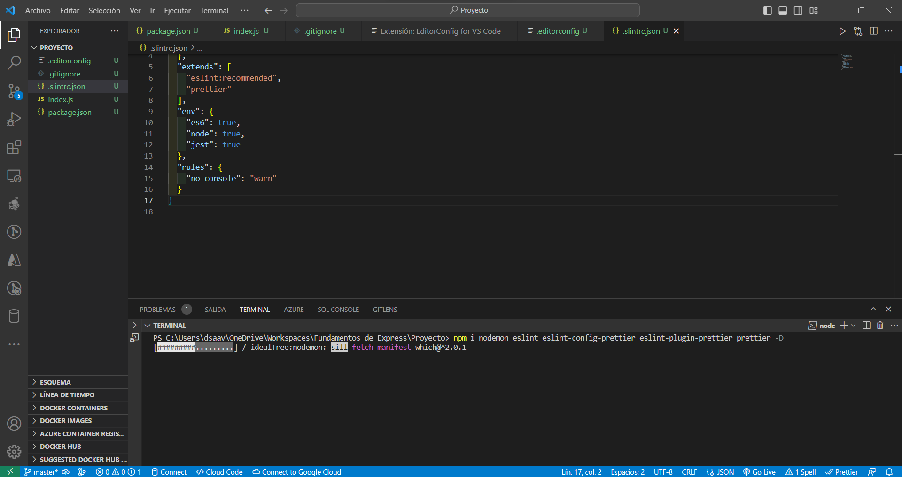

En este punto es necesario probar los entornos de desarrollo y producción

```bash
npm run dev
```

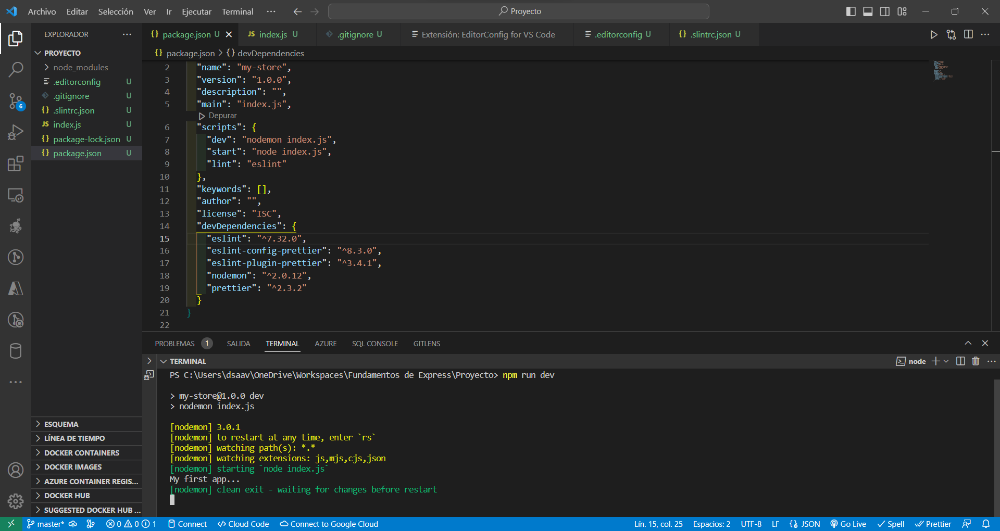

Ahora para correr en modo producción es necesario que corramos el siguiente comando.

```bash
npm run start
```

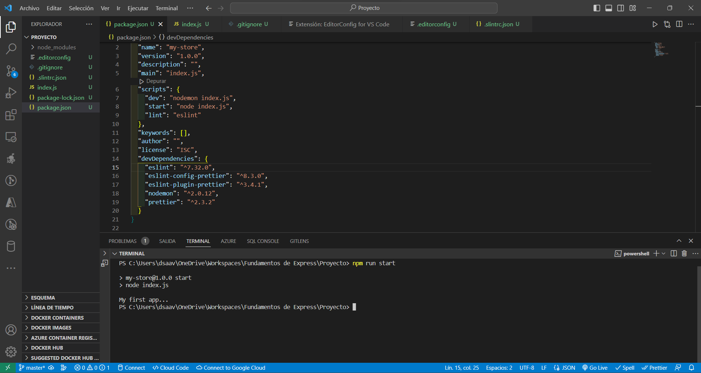

En la siguiente sección crearemos nuestro primer servidor de Node con Express.
---
## Instalación de Express.

Para poder utilizar este micro framework es necesario instalarlo, así que vamos a ello.

En este caso es necesario instalarlo como una dependencia de producción que es diferente a la de desarrollo.

```bash
npm i express
```
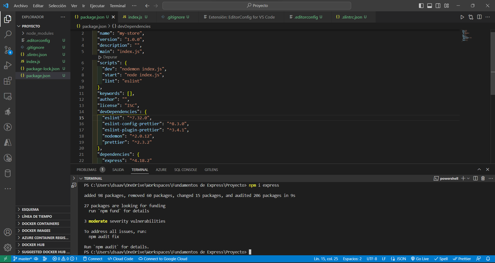

Ahora es momento de probar si tenemos express instalado, por ello es necesario que utilicemos la dependencia en los archivos de configuración. En el archivo package.json ahora ya tenemos el a Express como dependencia.

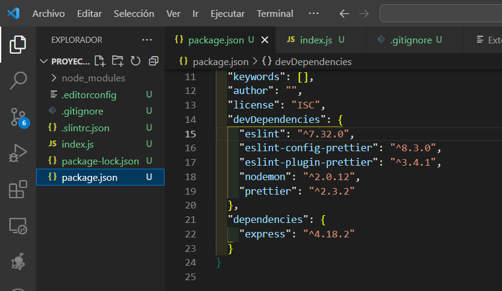

Es necesario recalcar que las dependencias de desarrollo están dentro de devDependencies y en este caso Express solo está en dependecies, es decir ahí la diferencia que es una dependencia de producción.

# Express como Servidor.

Para utilizar a express como servidor vamos al archivo **index.js** y agregamos el siguiente código

```js
const express = require('express');
const app = express();
const port = 3000;

app.get('/', (req, res) =>{
    res.send('Este es mi primer server en express')
});

app.listen(port, () => {
    console.log('Mi port' + port);
});
```
Para poder probar express vamos a utilizar nodemon, es un paquete muy útil en desarrollo

```bash
npm run dev
```
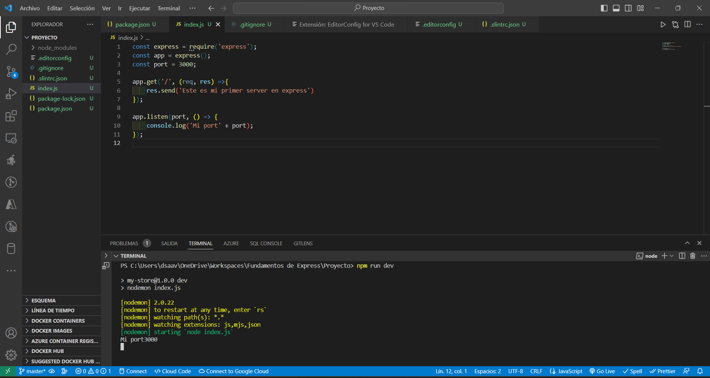

Podemos ver que está corriendo nuestro modo de desarrollo con nodemon, pero falta probarlo en el navegador.

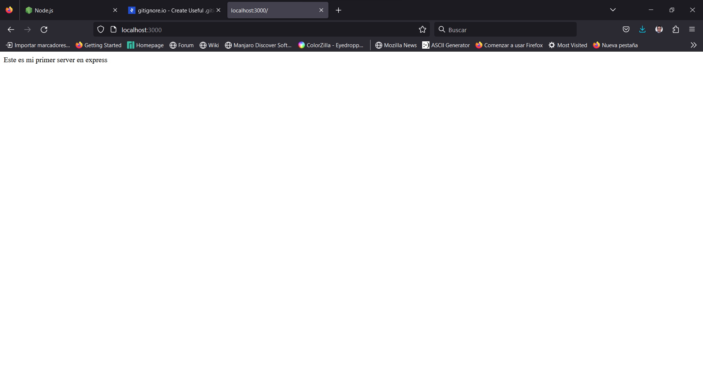

Es recomendable consultar la documentación oficial para cualquier duda que podamos tener

### Práctica: 

Puedes probar cambiando el puerto y verificando la salida por consola o por el navegador.
---
## Rutas

Hasta ahora hemos visto una ruta que nos mostraba el texto **Este es mi primer server en express**, pero en express es posible configurar más rutas, así que vamos a ello.

```js
app.get('/new', (req, res) =>{
  res.send('Esta es una nueva ruta')
});
```
Si no detenemos el servidor vamos a poder ver que se reinicia automáticamente y ahora en el navegador nos muestra el siguiente mensaje con la nueva ruta.


### Práctica

¿Pensemos en cual sería la ruta más adecuada para productos o servicios?

Sin embargo recordemos que express se caracteriza por brindar información y por lo general lo hace con formato **json**, así que vamos a intentarlo de esta forma.

```js
app.get('/productos', (req, res) =>{
  res.json({
    name: 'Product 001',
    price: 20.00,
  })
});
```
Si todo salio bien, en la ruta que podemos utilizar para nuestros productos veremos algo asi.

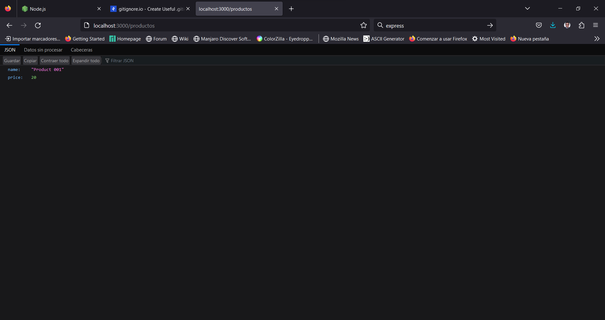

Sin probamos con Thunder Client o Postman, obtendremos las mismas respuestas que desde el navegador.

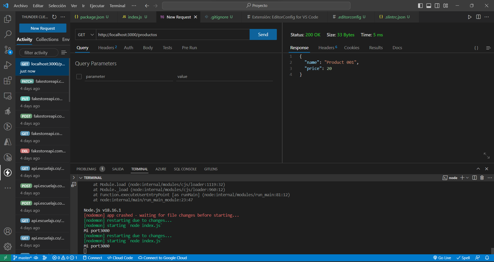

Recordemos que la ruta o también conocida como **End Point** atiende la solicitud de un cliente y brinda una respuesta.

### Práctica

Prueba crear nuevas rutas por ejemplo Categorías y prueba con la respuesta de Json o la respuesta normal de texto.
