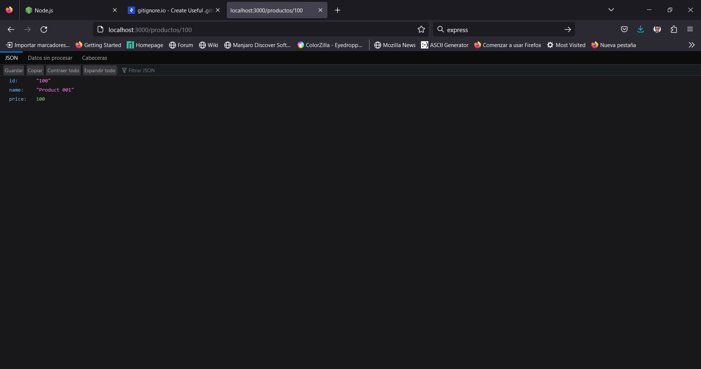
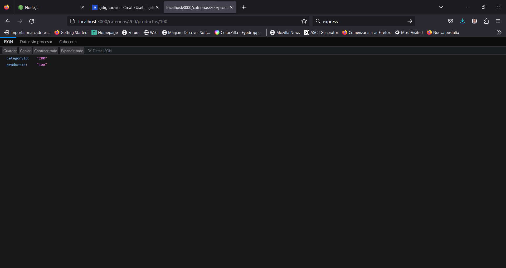

# Capítulo 2: CRUD

## ¿Qué es una RESTfull API?

Tratemos de entender esto de la mejor forma.

REST -> Representational State Transfer, esto es una convención que se tiene en backend y comúnmente sirve para hacer servicios web. Servicios que al final se comunican por el protocolo http, define como nosotros queremos modificar o alterar cierta información.

Los métodos más comunes son: **Get, Put/Patch, Post y Delete**.

Get: Normalmente nos permite obtener/solicitar esta información. Ej. Pedir a un servicio que nos retorne todos los productos de las bases de datos. Solicitar un producto mediante su id.

Put: Nos permite actualizar, es decir modifica la información de algún producto, por lo general se envía el Id del elemento que se desea modificar y se realiza la modificación.

Post: Nos permite crear información, por ejemplo si se desea crear un nuevo producto, una nueva categoría.

Delete: Por lo general se lo utiliza para eliminar información.

Pero, ¿Como funciona la conversión de RESTApi?

| Method       | /products | /products/{id}   |
|--------------|-----------|------------      |
| GET          | Get list  | Get              |
| PUT          | Replace  (No aconsejable) | Update/Replace   |
| PATCH        | No Apply  | Update           |
| POST         | Create    | No Apply         |
| DELETE       | Delete  (No aconsejable)  | Delete           |

La convención nos dice que por cada entidad que tengamos, vamos a tener una ruta llamado **products** y también un  **id** opcional, sin importar si tenemos una base de datos relacional o no relacional. El Id es un identificador único para cada producto.

Por ejemplo si quiero obtener la lista de productos, enviaría el **End Point /products** con el método **GET** y obtendría la **lista de productos**. Si por el contrario quiero obtener algún producto en particular, puedo repetir el **End Point**, pero en este caso a **/products** aumentaría el **id del producto** quedado como se muestra en la última columna.

La diferencia enter PUT y PATCH es que con PUT yo debo enviar todos los datos para remplazarlos y con PATCH basta que envíe solo el campo o los campos que deseo modificar.

Con el método POST por lo general se utiliza para crear, en este caso enviaría el End Point /products y como no se cual será el Id no aplicaría un Id como tal.

Y el método DELETE no se aconseja eliminar en global, es necesario el uso del Id para eliminar solo la información necesaria de eliminar.

En resumen esta es la convención que se utiliza para poder crear un **CRUD**

---

## Método GET: Recibe Parámetros.

En esta sección vamos a aprender como funciona GET, como recibir un parámetro y las conversiones REST.

Normalmente cuando tenemos un **END POINT** primero debemos definir la **Entidad** y luego el **Id**

Observemos los siguientes ejemplos:

* api.espe.edu.ec/tasks/{id}/

Por ejemplo en este caso si queremos obtener una tarea en específico, primero enviamos la **entidad** (tasks) y luego el **id**
* api.espe.edu.ec/people/{id}/

Es similar al caso anterior, la entidad es **people** y enviamos el **id**.
* api.espe.edu.ec/users/{id}/tasks/

En este último caso tenemos una entidad **users** y queremos conocer las tareas de un usuario en específico, es por ello que primero enviamos el **Id** y luego la entidad **tasks**.

Una buena práctica es que las entidades se implementen en plural, Ej. Tasks, People, Users.

Continuamos con nuestro proyecto, en este caso vamos a modificar la entidad **/productos**. Puesto que ahora solo devuelve un producto, y en base a lo último que hemos aprendido esperamos como respuesta no uno, sino una lista de productos.

```js
app.get('/productos', (req, res) =>{
  res.json([
    {
      name: 'Product 001',
      price: 20.00
    },
    {
      name: 'Product 0012',
      price: 100.00
    }
  ])
});
```
Cambiamos nuestro método get en lugar de solo un producto, aplicamos 2 mediante un array
La respuesta del servidor sería ahora de 2 productos.


Ahora vamos a conocer como se debe modificar el código para recibir el detalle de un producto mediante un Id.

```js
app.get('/productos/:id', (req, res) => { //los 2 puntos son porque recibe un parámetro.
  const {id} = req.params;            // vamos a recoger el id que nos envían
  res.json({
    id,
    name: 'Product 001',
    price: 100.00
  })
});
```
Veamos el resultado de este nuevo **End Point**.



Ahora vamos a intentar enviar un End Point con 2 parámetros.

```js
app.get('/cateorias/:categoryId/productos/:productId', (req, res) => {
  const { categoryId, productId } = req.params;
  res.json({
    categoryId,
    productId
  });
})
```

Asi se ve en el navegador 



Práctica.

Crea varias entidades que se puedan necesitar 